# Expresso cafe Application Checklist

## Database Design

- [ ] Create an ER diagram of the database
- [ ] Write Create table scripts [script](path/to/sql/file)

## Project Setup

- [ ] Create a new Java project
- [ ] Set up a MySQL database
- [ ] Add necessary libraries
	- [ ] JDBC, 
	- [ ] MySQL Connector, 
	- [ ] JUnit, 
	- [ ] Dotenv
	
## Module : User
* Attributes
	* int user_id
	* String name
	* long phone number
	* String email
	* String password
	* String address

### Feature  : Create User  
### User story :
>User created successfully and the user details will be stored in database.
### Pre-requisites:

-  user DAO (create)
-  user service ( create )
#### Validations:  
- [ ] Form validator  
	* user ( null )  
	* name ( null, empty, pattern )  
	* email ( null, empty, pattern )  
	* password ( null, empty, pattern )
	* phone number ( length, >= 600000001 && <= 9999999999 )
- [ ] Business Validation  
	* Phone number already exists
	* Email Already exists
#### Messages:  
* User object cannot be null  
* Name cannot be null or empty
* Name should be match with the given pattern
* Email cannot be null or empty
* Email Should be match with the given pattern
* Phone number should  be match with the given pattern
* Password cannot be null or empty
* Password must contains at least 8 characters
* Password should be match with the given pattern 
* User already exists  
#### Flow:  
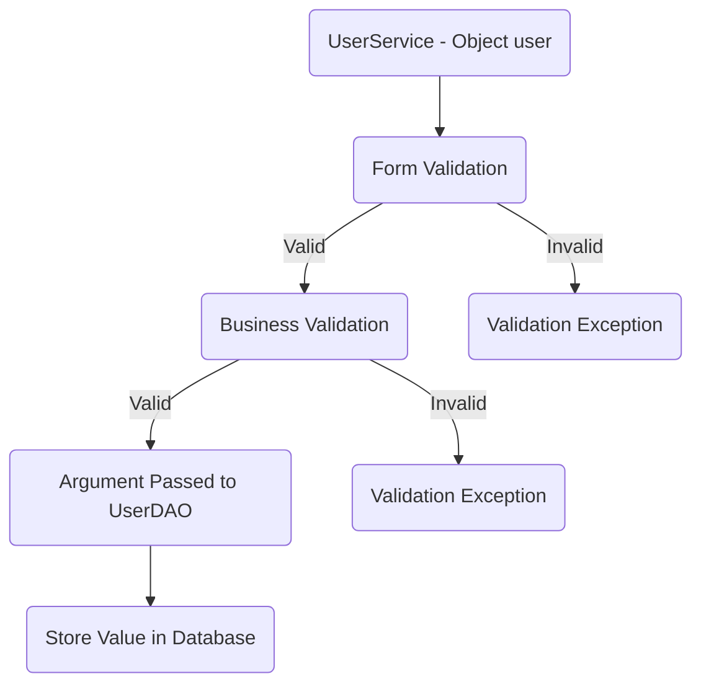
### Feature : Update User  ​
### User story :
>User details successfully updated and stored in database.
### Pre-requisites:- 
- [ ] completed feature 1 - create user
- [ ] user dao ( update )
- [ ] user service ( update ) 
#### Validations:  
- [ ] Form validator  
	*  id (less than or equal to 0) 
	* name ( null, empty, pattern )  
	* password (null , empty, pattern )
- [ ] Business Validation  
	* Check whether the id exist
#### Messages:  
* Id cannot be 0 or in negative  
* Email cannot be null or empty
* Email should be match with the given pattern
* Phone number should match with the given pattern
*  Name cannot be null or empty
* Name should be match with the given pattern
* Password cannot be null or empty
* Password must contains at least 8 characters
* Password should match with the given pattern 
* User not found  

#### Flow:  
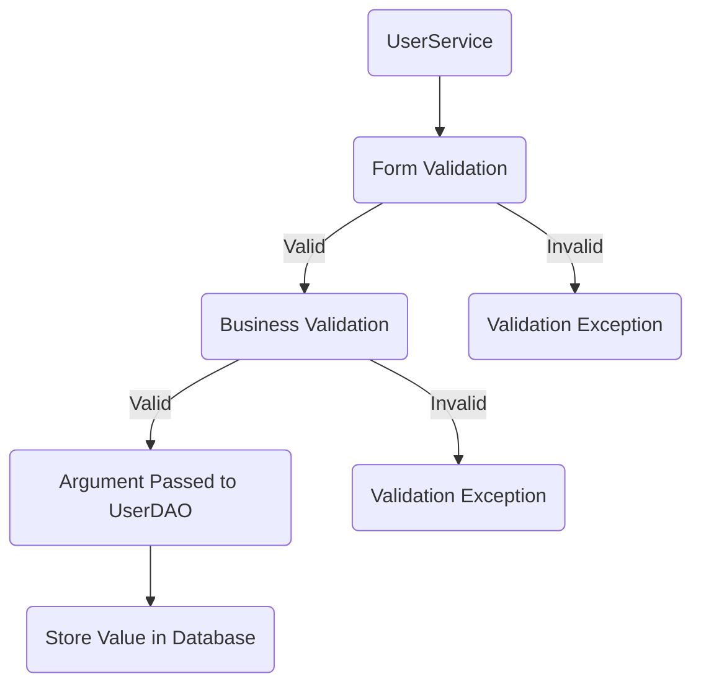
### Feature  : Delete User  
### User story :

> User wants to delete his account.
​

### Pre-requisites:- 
- [ ] completed feature 1 - create user
- [ ] user dao ( delete )
- [ ] user service ( delete )
#### Validations:  
- [ ]  Form Validation 
	* id (less than or equal to 0)
	* phone number (greater than 6000000001 and less than 9999999999)
	* email (null, empty, pattern) 
- [ ] Business Validation  
	* Check whether the id exist
#### Messages:  
* Id cannot be 0 or in negative  
* Email cannot be null or empty
* Email should be match with the given pattern
* Phone number should match with the given pattern
*  Name cannot be null or empty
* Name should be match with the given pattern
* Password cannot be null or empty
* Password must contains at least 8 characters
* Password should match with the given pattern 
* User not found  
#### Flow:  
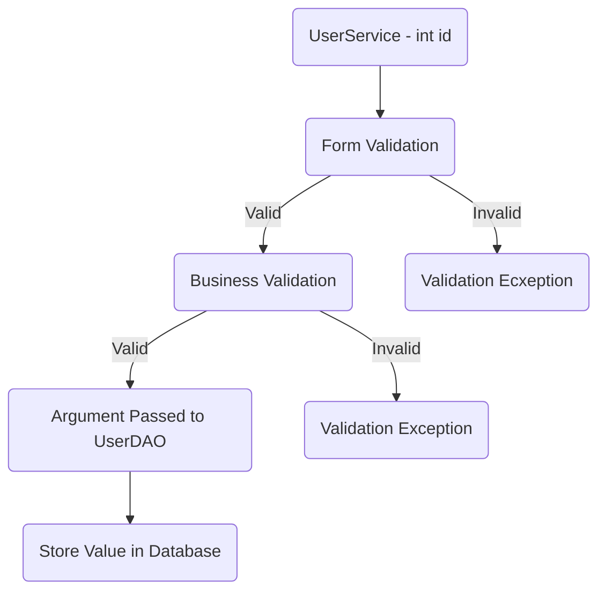

## Module 1: Product
###  Attributes
-   int product_id (Primary Key)
-   String name
-   String description
-   int price_small
-   int price_medium
-   int price_large
-  createdAt Date
-  endedAt  Date
-  boolean status (true = active, false = inactive) [Default value: true]
### Feature 1: Create Product
#### User Story:
>As a user, I want to create a new product and set prices for its three different sizes.
#### Prerequisites:-  completed product module

- [ ] size table
- [ ] size model
- [ ] size DAO ( findAll, findById )
- [ ] size Service ( findAll, findById ) 
- [ ] category table 
- [ ] category model
- [ ] categoryDAO (findAll , findById)
- [ ] categoryService (findAll , findById)
- [ ] ProductDAO (create)
- [ ] PriceDAO (create)
- [ ] ProductService(create)
- [ ] PriceService(create)

#### Validations:  
 - [ ]  Form Validation:
   -   Name and description should not be empty or null.
   -   Name should match given pattern.
    -   Prices for small, medium, and large should be above 0.
- [ ]   Business Validation:
   -   Check if the product name already exists .
   -  Validate prices hierarchy  
#### Messages:

-  Product name is required and must follow the specified pattern.
-  Product name is already in use.
-  Product description is required.
-  Prices must be greater than 0 for all sizes.
-   Large price must be equal to or greater than medium price.
-   Medium price must be equal to or greater than small price.
#### Flow
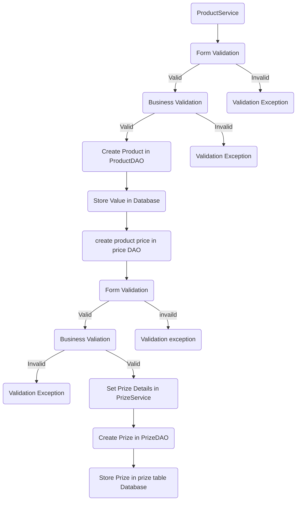

### Feature 2: Update Product
#### Attributes:
-   int product_id
-   String name
-   String description
#### User Story:
> As an admin, I want to update product details, so the customers can see accurate information.
#### Prerequisites:
- [ ] completed feature 1 - create product
- [ ]  product Service (update product)
- [ ]   product DAO (update product)
#### Validations:
- [ ] Form Validation:
    -   Product name must not be null, empty.
    -  Product name should follow the specified pattern.
    -   Product description must not be null or empty.
- [ ]  Business Validation:
    -   Check if the product name already exists in the database.
#### Messages:
##### Form Validation Messages:

-   Product name cannot be null or empty.
-   Product name should follow the given pattern.
-   Description cannot be null or empty.

##### Business Validation Messages:

-   Product should already exists.

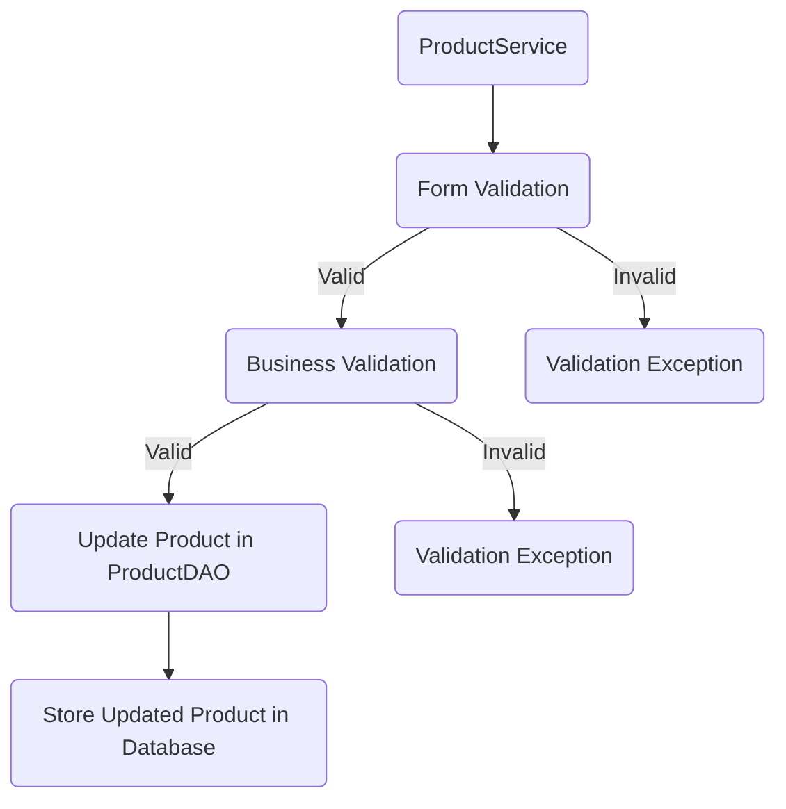

### Feature 3: Delete Product

#### User Story:
> As an admin, I want to delete a product, so it will no longer be visible to customers.
#### Prerequisites:
- [ ]    Complete feature 1 - create product 
- [ ]    product Service (delete product)
- [ ]    product DAO (delete product)
#### Validations:

- [ ] Form Validation
	* Product ID must be a positive integer .
	* Product name must not be null or empty .
- [ ] Business Validation
	* Check if the product with the given ID or name exists .
	* Check if the product status is active .
  - [x] Messages

#### Messages:

##### Form Validation Messages:

-   Product ID must be a positive integer  .
-   Product name cannot be null or empty .

##### Business Validation Messages:

-   Product with the given ID or name does not exist.
-   Product with the given ID is not active .

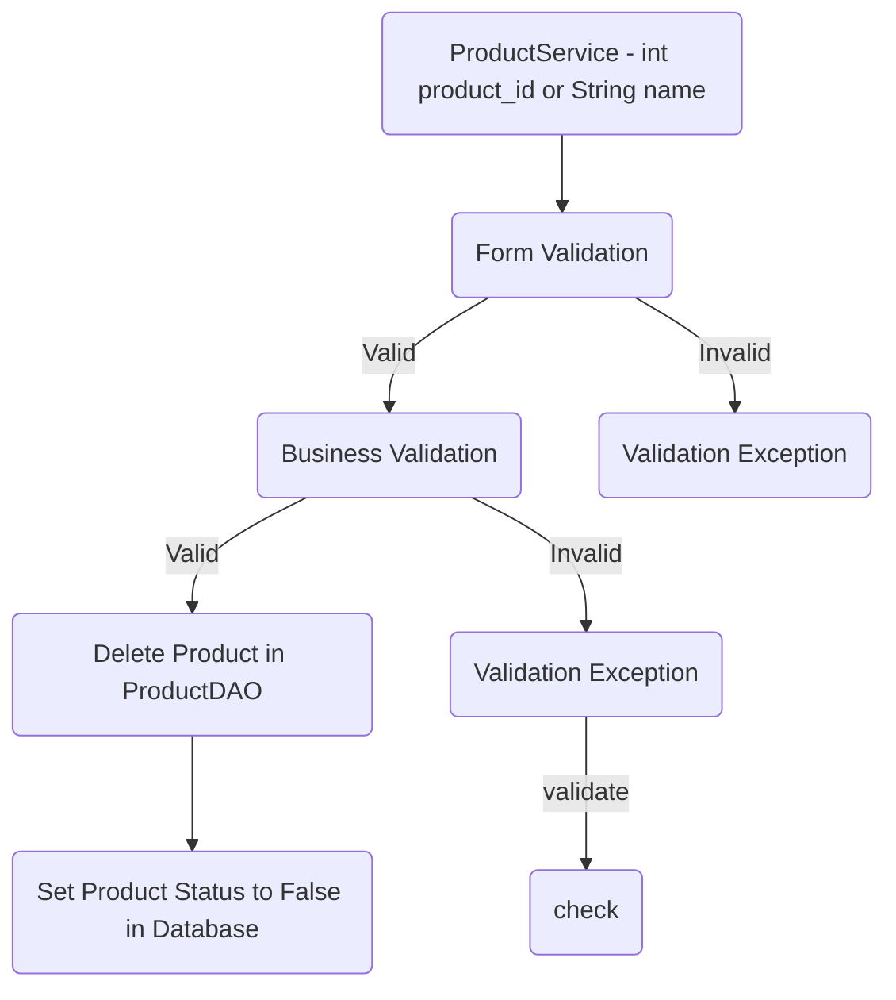

### Feature 4: List All Products

#### User Story:

> As an admin, I want to view a list of all products in the system, along with their names, descriptions, and prices for different sizes.

#### Prerequisites:
- [ ] complete feature 1 (create)
- [ ] product Service(retrieve all products)
- [ ]  price Service (retrieve prices for a product)
- [ ]   product DAO (retrieve all products)
- [ ]  price DAO (retrieve prices for a product)

#### Validations:
None

#### Flow:
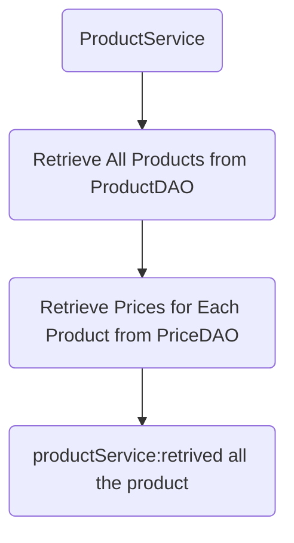

### Feature 5: Find Product by product  ID

#### User Story:

> As an admin, I want to retrieve a specific product by providing its ID, along with its prices for different sizes.

#### Prerequisites:
- [ ] complete feature 1 - create
- [ ]  product Service (retrieve product by product ID)
- [ ]  price Service (retrieve prices for a product)
- [ ]   product DAO (retrieve product by product  ID)
- [ ]   price DAO (retrieve prices for a product)
#### Validations:
- [ ] Form Validation:
  * Product ID must be valid (greater than 0).
- [ ] Business Validation:
   *  Check if the product with the given ID exists .
### Messages:
 ####     Form Validation Messages:
   -  Product ID must be valid (greater than 0).
#### Business Validation Messages:
   -    Product with the given ID does not exist.
#### Flow
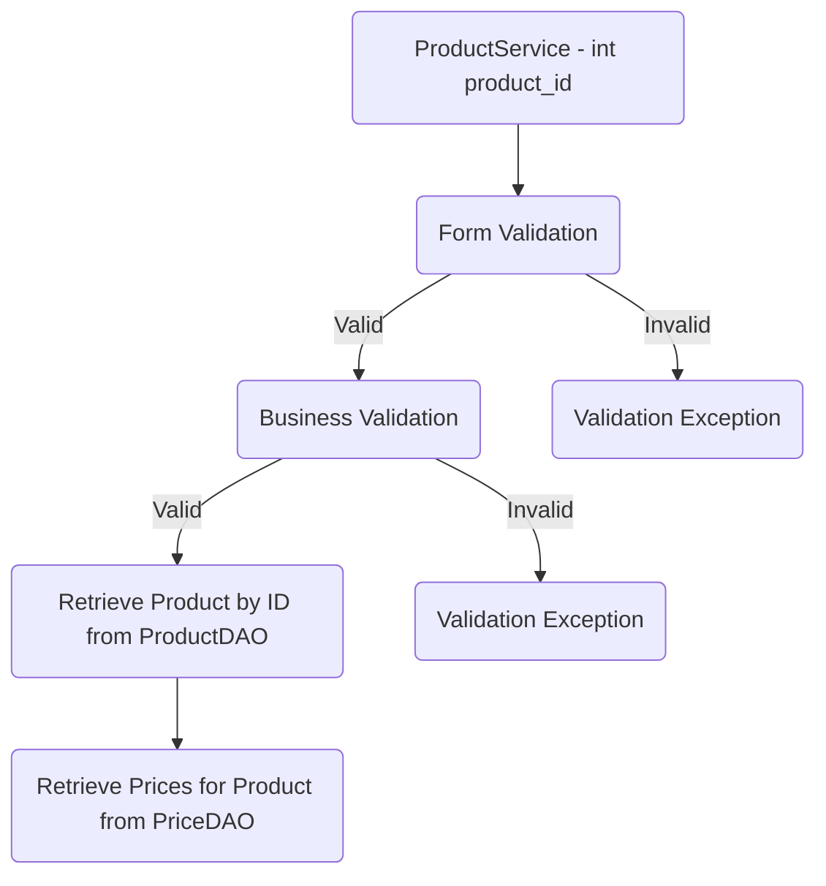

### Feature 6: Find Products by Category ID
#### User Story:
> As an admin, I want to retrieve a list of products belonging to a specific category by providing its ID with their prices.

#### Prerequisites:
- [ ] completed feature -1 (create)
- [ ]   Product DAO (retrieve products by category ID)
- [ ]  productService (retrieve products by category ID)
#### Validations:
- [ ] Form Validation:
     * Category ID must greater than 0.
- [ ] Business Validation:
     *  Check if the category with the given ID exists.
### Messages:
#### Form Validation Messages:
-   Category ID must greater than 0.
#### Business Validation Messages:
-   Category with the given ID does not exist.
#### Flow
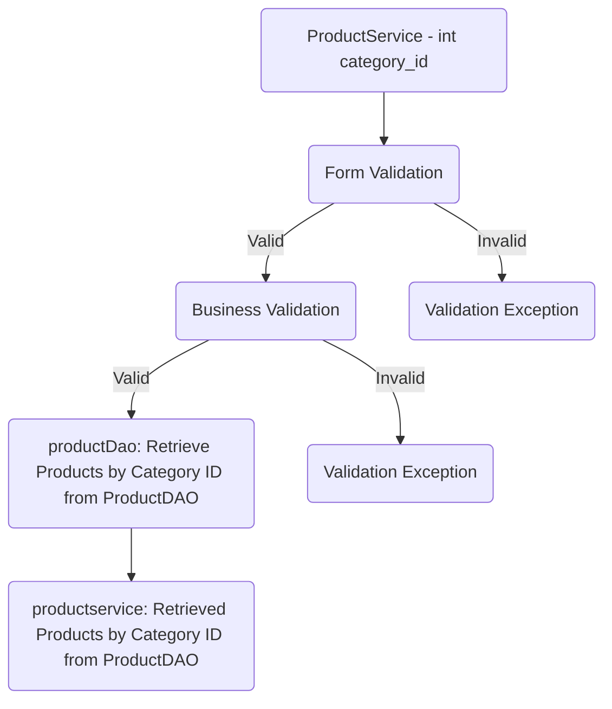
## Module 2: Price
### Feature 7: Update Price
-   Attributes
   
    -   int price_id
    -   int product_id (foreign key)
    -   double price
    -   int size_id (foreign key)
    -   createdDate
    -   ended Date
### User story:

>  The price for a specific product and size is updated successfully.

### Pre-requisites:
- [ ] completed product module
- [ ]   price DAO (update price)
- [ ]   price service (update price)
- [ ]   productDAO (update price)
- [ ]  product service (update price)

### Validations:
- [ ]  Form Validation
  
    *   product_id (greater than  0)
    *   price (greater than 0)
    *   size_id (greater than 0)
- [ ] Business Validation
    
    *   Check whether the product_id exists
    *   Check whether the size_id exists
    *   Check whether the same price been updated again
    *   Product price already exists .
    * The end Date should be not null.

#### Messages:
-   Product ID cannot be 0 or negative
-   Price cannot be less than 0
-   Size ID cannot be 0 or negative
-   Product with the given ID does not exist
-   Size with the given ID does not exist
-   Same prize need not to be updated
#### Flow:
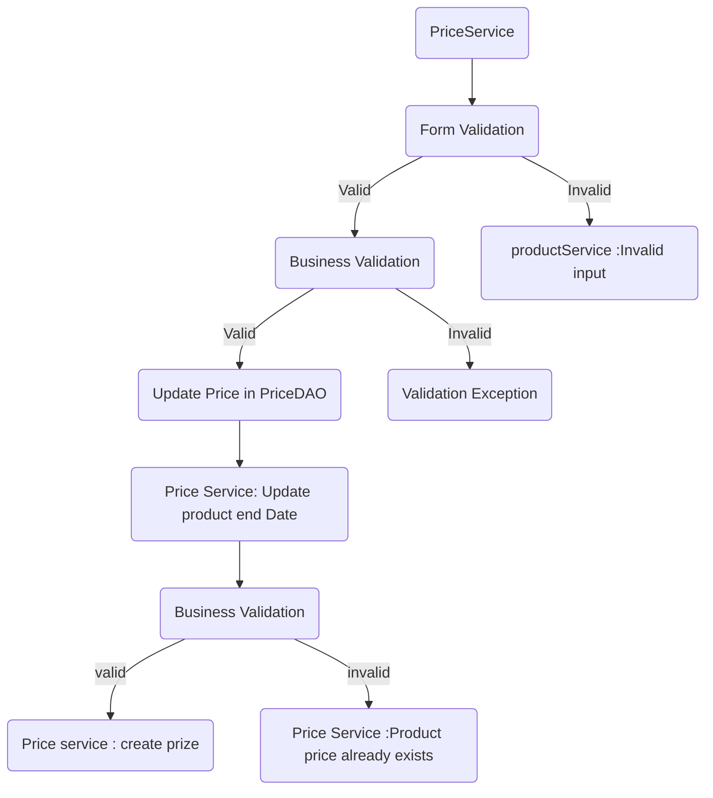
### Feature 8: Get All Price History
-   Attributes
  
    -   int price_id
    -   int product_id (foreign key)
    -   double small_price
    -   double medium_price
    -   double large_price
    -   int size_id (foreign key)
    -  createdDate
    -  ended Date
    
#### User story:

> All price history for a specific product and size is retrieved successfully.

#### Pre-requisites:
- [ ]  completed product module
- [ ]  price DAO (get all price history)
- [ ]   price service (get all price history)
#### Validations:
- [ ]  Form Validation
 
    -   product_id (should be greaterthan  0)
    -   size_id (should be greaterthan  0)
- [ ]  Business Validation
   
    -   Check whether the product_id exists
    -   Check whether the size_id exists

#### Messages:

-   Product ID cannot be 0 or negative
-   Size ID cannot be 0 or negative
-   Product with the given ID does not exist
-   Size with the given ID does not exist

####  Flow:

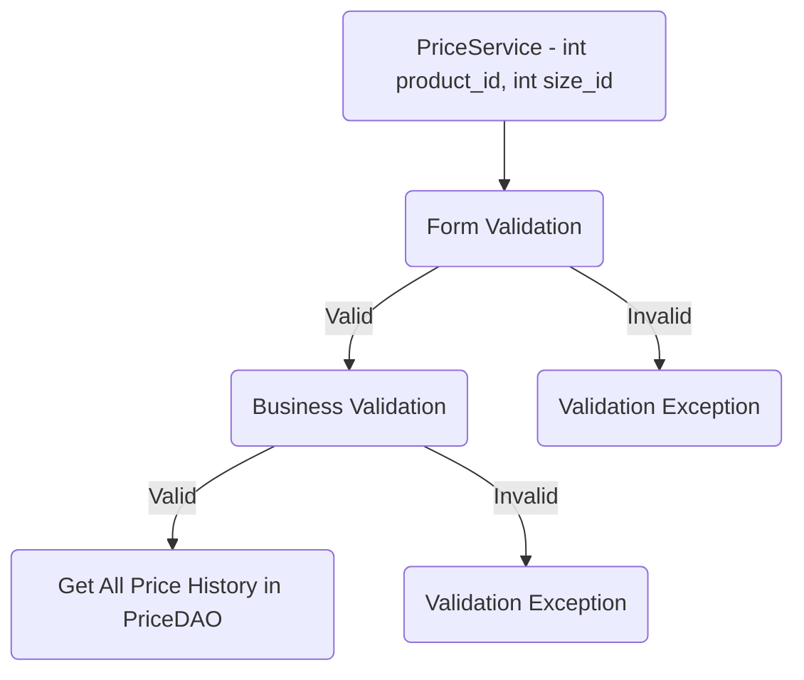
